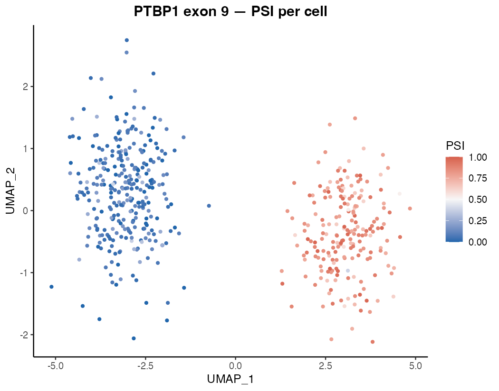
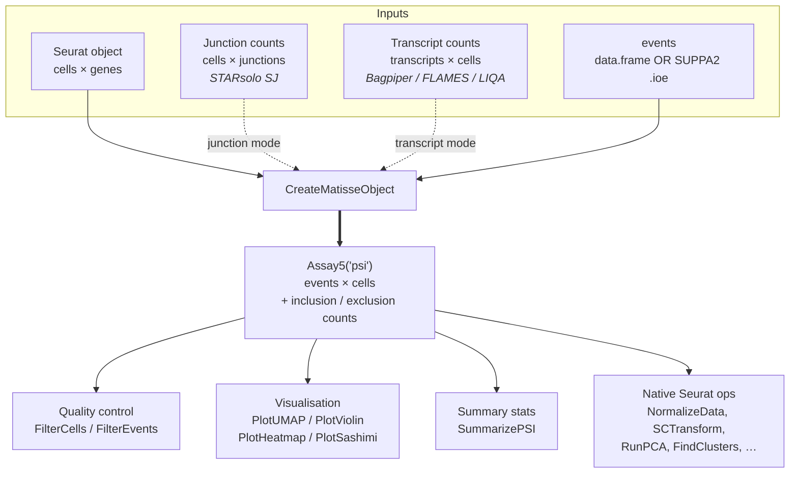

# Matisse: Multi-modal Analysis of Transcript Isoforms in Single-Cell Sequencing Experiments

<!-- badges: start -->
[](https://github.com/avisrilab/Matisse/actions/workflows/R-CMD-check.yml)
[](https://avisrilab.github.io/Matisse)
<!-- badges: end -->

**Understand your cells, layer by layer — splicing and gene expression together**

Most single-cell tools stop at gene expression. Matisse goes further: it measures *which isoform* each cell is making, and links those choices to cell identity. Some cell types skip exons. Others include them. Matisse lets you see all of this, in the same object, on the same UMAP.

<!-- TODO: replace with final figure once paper figures are locked -->
<!--  -->
<!-- TODO: one-sentence figure caption -->

---

## What you can discover

- **Cell-type-specific splicing** — Do my neurons and astrocytes process this exon differently?
- **Splicing along a trajectory** — Is there a coordinated isoform switch as cells differentiate?
- **Context for bulk data** — I see a splicing change in bulk RNA-seq — which cell type is driving it?
- **Chromatin shapes isoforms** — Is the splicing switch linked to chromatin accessibility at the same locus? *(via Signac integration)*

---

## How it works

For each cell and each splicing event, Matisse calculates a **PSI value** (Percent Spliced In): the fraction of that cell's transcripts that include a given exon.

- **PSI = 1** — every transcript in that cell includes the exon
- **PSI = 0** — every transcript skips the exon
- **PSI = 0.5** — half include, half skip

PSI values are stored as a Seurat `Assay5` alongside your gene expression data in a single object, so you can overlay splicing on any plot you have already made — UMAPs, violin plots, heatmaps.

---

## Works with your existing setup

Matisse layers on top of [Seurat](https://satijalab.org/seurat/) and [Signac](https://stuartlab.org/signac/) — your clustering, UMAP, and cell-type labels stay exactly as they are.

| Input | Tool | Format |
|---|---|---|
| Short-read RNA (10x Chromium) | STARsolo | junction count matrix |
| Long-read / isoform-resolved | Bagpiper, FLAMES, LIQA | transcript counts + SUPPA2 `.ioe` files |
| Chromatin accessibility | Signac, ArchR | embedded Signac object |

---

## Installation

```r
# install.packages("remotes")
remotes::install_github("avisrilab/Matisse")
```

---

## Quick start

### Short-read RNA (10x / STARsolo junction counts)

```r
library(Matisse)
library(Seurat)

# 1. Your existing Seurat object -- clusters, UMAP, everything intact
seu <- readRDS("my_seurat.rds")

# 2. Junction count matrix from STARsolo (cells x junctions). Junction IDs
#    encode coordinates (e.g. "chr1-12345-67890-+"), auto-parsed for sashimi.
jxn_counts <- readRDS("junction_counts.rds")

# 3. Splice event table (from SUPPA2 generateEvents, rMATS, or hand-curated)
event_data <- read.csv("events.csv")

# 4. Build the Matisse object — PSI is computed at construction
obj <- CreateMatisseObject(
  seurat          = seu,
  junction_counts = jxn_counts,
  events          = event_data,
  min_coverage    = 5L
)

# 5. Quality control
PlotViolin(obj)                             # inspect nCount/nFeature/nPercent
obj <- FilterCells(obj,
                   min_features_isoform = 5,
                   min_pct_isoform      = 10)
obj <- FilterEvents(obj, min_cells_covered = 20)

# 6. Visualise -- overlay splicing on your UMAP
PlotUMAP(obj,   feature  = "SE_PTBP1_e9")
PlotViolin(obj, feature  = "SE_PTBP1_e9", group_by = "seurat_clusters")
PlotHeatmap(obj)
```

### Long-read / isoform-resolved (Bagpiper / FLAMES / LIQA)

```r
# Transcript count matrix (transcripts x cells) + SUPPA2 .ioe annotation.
# `events` accepts a character vector of file paths (parsed internally) or
# a pre-built data.frame. PSI is computed at construction in both modes.
obj <- CreateMatisseObject(
  seurat            = seu,
  transcript_counts = transcript_counts,
  events            = c("events_SE.ioe", "events_RI.ioe"),
  min_coverage      = 5L
)

# QC, filtering, and visualisation are identical from here
```

---

## At a glance



---

## Documentation

Full walkthrough and function reference: **<https://avisrilab.github.io/Matisse>**

---

## Citation

<!-- TODO: update when preprint / paper is posted -->
If you use Matisse in your research, please cite:

> Srivastava A. (2026). *Matisse: Multi-modal Analysis of Transcript Isoforms in Single-Cell Sequencing Experiments*. R package version 0.1.0. https://github.com/avisrilab/Matisse
