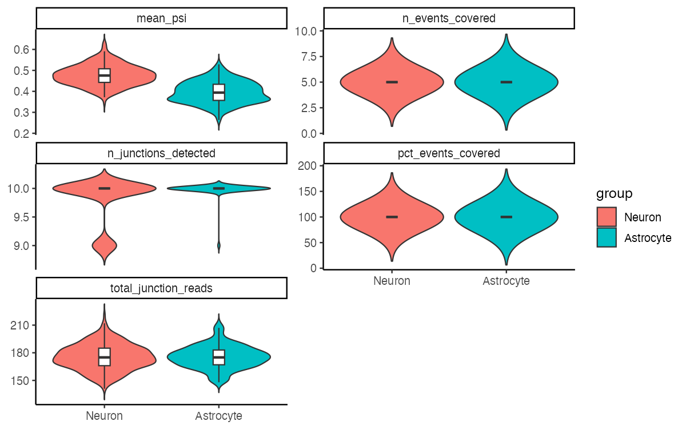
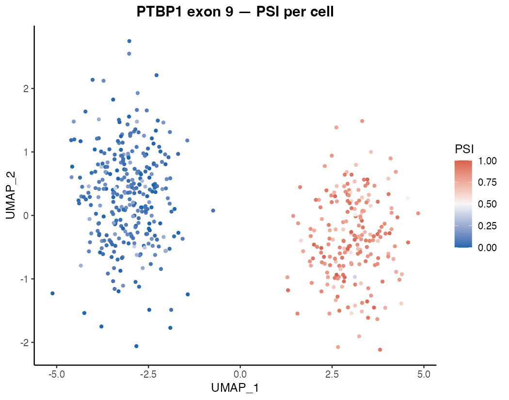
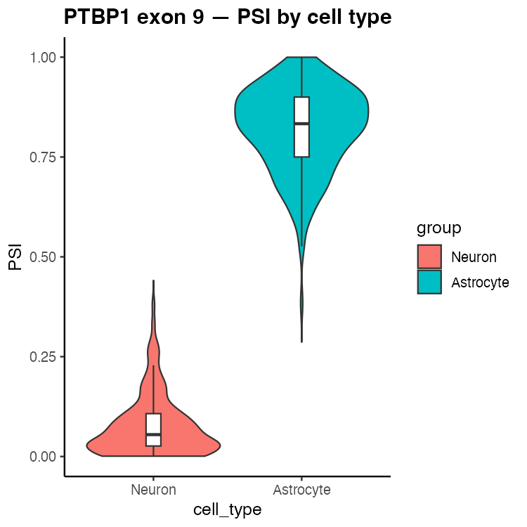
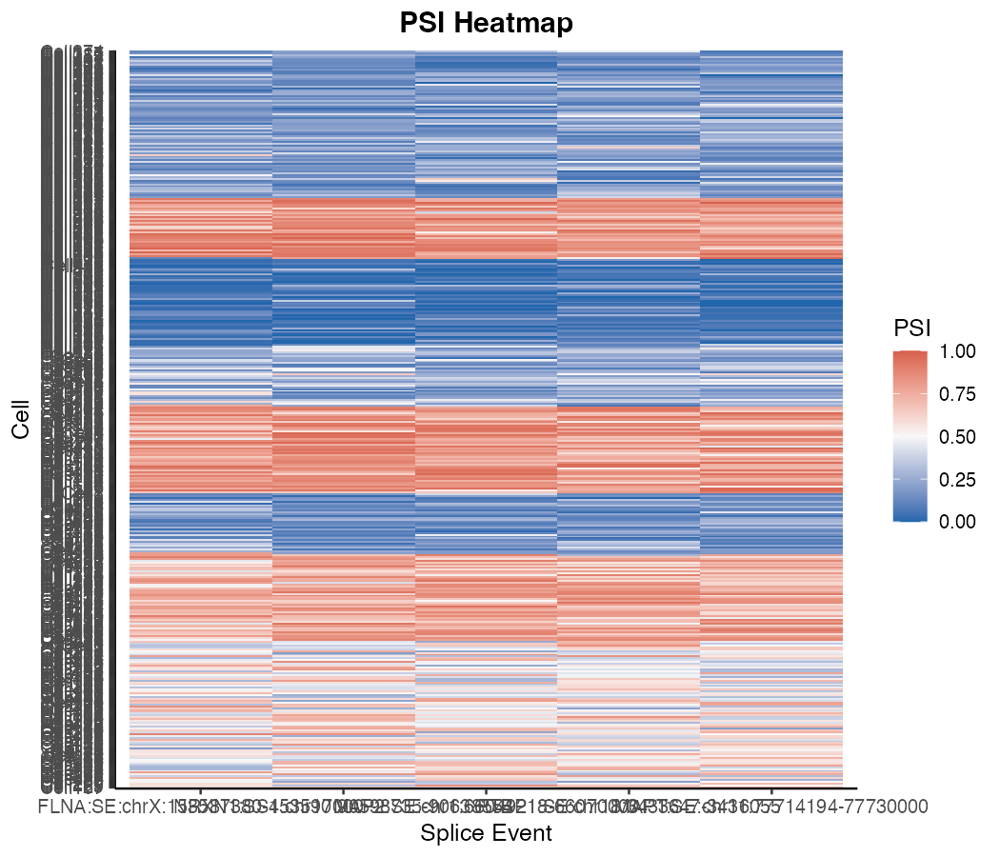

```{r setup, include = FALSE}
knitr::opts_chunk$set(collapse = TRUE, comment = "#>")
```

## What does Matisse do?

Genes can be spliced in different ways: certain exons may be included in some
transcripts but skipped in others. This is called **alternative splicing**, and
it means one gene can produce multiple protein isoforms with different functions.

Matisse measures alternative splicing **one cell at a time**. For each cell in
your dataset, it calculates a **PSI value** (Percent Spliced In) for each
splicing event you care about:

- **PSI = 1** — every transcript in that cell includes the exon
- **PSI = 0** — every transcript skips the exon
- **PSI = 0.5** — half include, half skip

By comparing PSI values across your cell types, clusters, or conditions, you can
identify which populations splice genes differently — and by how much.

Matisse sits on top of your existing [Seurat](https://satijalab.org/seurat/)
workflow. Your gene expression data, UMAP, and cluster labels stay intact;
splicing information is simply added alongside them.

---

## A worked example: the PTBP1 splicing switch in mouse cortex

One of the best-studied examples of cell-type-specific splicing is *Ptbp1* exon
9. In non-neuronal cells (astrocytes, progenitors), this exon is **included** in
most transcripts (high PSI). As cells differentiate into mature neurons, a
neuron-specific splicing factor switches this off: exon 9 is **skipped** in
almost all neuronal transcripts (low PSI). This switch has functional
consequences for PTBP1 protein activity and downstream splicing regulation.

Here we analyse 500 single cells from mouse cortex — 300 neurons and 200
astrocytes — and use Matisse to detect this switch and survey splicing
differences across five well-characterised alternative exons.

> **Note:** The code below shows every step of the analysis. Because the data
> are not bundled with the package, chunks are set to `eval = FALSE`. The
> figures shown were generated from a simulated dataset that closely mirrors
> the PSI distributions observed in published mouse cortex scRNA-seq studies.

---

## Step 1 — Build the Matisse object

Starting materials:

- A **Seurat object** (`seu`) already processed through clustering and UMAP
- A **junction count table** (`jxn_counts`) from STARsolo — one row per cell,
  one column per exon-exon junction, values = number of reads crossing each
  junction in that cell
- A **splice event table** (`event_df`) defining which junctions support
  inclusion versus skipping for each event of interest

```{r build-object, eval=FALSE}
library(Matisse)

obj <- CreateMatisseObject(
  seurat          = seu,
  junction_counts = jxn_counts,
  event_data      = event_df
)
```

---

## Step 2 — Calculate PSI

For each cell and each splicing event, Matisse sums the reads from
inclusion-supporting junctions and exclusion-supporting junctions, then
computes the ratio. Cells with fewer than `min_coverage` total reads for an
event are left as missing — not enough data to call a reliable splicing ratio.

```{r calculate-psi, eval=FALSE}
obj <- CalculatePSI(obj, min_coverage = 5)
```

---

## Step 3 — Quality control

Before interpreting results, check that each cell has enough junction data to
be reliable.

```{r compute-qc, eval=FALSE}
obj <- ComputeIsoformQC(obj)
PlotQCMetrics(obj, group_by = "cell_type")
```

```{r fig-qc, echo=FALSE, out.width="90%", fig.cap="Per-cell splicing QC metrics split by cell type. Both neurons and astrocytes show similar junction detection rates and event coverage, indicating balanced data quality across populations."}

```

Both cell types show comparable data quality: nearly all cells detect all 10
junctions and achieve full event coverage. No filtering is needed here, but in
a noisier real dataset you would remove low-quality cells at this stage:

```{r filter, eval=FALSE}
# Remove cells with too few detected junctions or too little event coverage
obj <- FilterCells(
  obj,
  min_junctions      = 5,
  min_junction_reads = 20,
  min_pct_covered    = 10
)

# Remove events that are measurable in too few cells or show no variation
obj <- FilterEvents(
  obj,
  min_cells_covered = 20,
  min_psi_variance  = 0.01
)
```

---

## Step 4 — Visualise the PTBP1 splicing switch

### Where does the switch happen on the UMAP?

Overlay the PTBP1 exon 9 PSI value onto the cell UMAP. Each dot is a cell,
coloured by its PSI value: blue = exon skipped (low PSI), red = exon included
(high PSI).

```{r umap, eval=FALSE}
PlotPSIUMAP(
  obj,
  event_id = "PTBP1:SE:chr18:3433647-3436055",
  title    = "PTBP1 exon 9 — PSI per cell"
)
```

```{r fig-umap, echo=FALSE, out.width="80%", fig.cap="UMAP coloured by PTBP1 exon 9 PSI. Neurons (left cluster) are uniformly blue — exon 9 is almost always skipped. Astrocytes (right cluster) are uniformly red — exon 9 is almost always included. The splicing switch perfectly mirrors the cell-type boundary."}

```

The two clusters are completely separated by splicing state alone — without
using any gene expression information.

### How large is the difference?

```{r violin, eval=FALSE}
PlotPSIViolin(
  obj,
  event_id = "PTBP1:SE:chr18:3433647-3436055",
  group_by = "cell_type",
  title    = "PTBP1 exon 9 — PSI by cell type"
)
```

```{r fig-violin, echo=FALSE, out.width="60%", fig.cap="Distribution of PTBP1 exon 9 PSI values in neurons versus astrocytes. Neurons cluster tightly near PSI = 0 (exon nearly always skipped); astrocytes cluster near PSI = 0.8–1.0 (exon nearly always included). This near-binary switch is characteristic of a regulated developmental splicing event."}

```

Neurons show a tight distribution near PSI = 0 (median ~0.08); astrocytes show
a tight distribution near PSI = 0.82. The difference is large, consistent, and
cell-type-specific — exactly the signature of a developmentally regulated
splicing switch.

---

## Step 5 — Survey splicing across multiple events

Use the heatmap to get an overview of all five events at once, with cells
ordered by cell type. Rows are cells, columns are splicing events.

```{r heatmap, eval=FALSE}
PlotPSIHeatmap(obj, group_by = "cell_type", max_cells = 400)
```

```{r fig-heatmap, echo=FALSE, out.width="85%", fig.cap="PSI heatmap across five alternative exons. Cells are ordered by cell type (neurons top half, astrocytes bottom half); events are hierarchically clustered. PTBP1 and NRXN1/MAP2 show opposing directionality — events skipped in neurons are included in astrocytes and vice versa. FLNA exon 30 shows no difference, confirming the pattern is event-specific rather than a global shift."}

```

The heatmap reveals the overall splicing landscape:

- **PTBP1 exon 9**: low PSI in neurons, high in astrocytes (exon skipped in neurons)
- **NRXN1 SS4** and **MAP2 exon 16**: high PSI in neurons, low in astrocytes (neuron-enriched inclusion)
- **FLNA exon 30**: no difference between cell types — a useful negative control showing that not every event is regulated
- **MAPT exon 10**: mild difference, illustrating that splicing changes come in a spectrum of effect sizes

---

## Workflow 2: long-read and transcript-resolved data

The junction-count workflow above works with **short-read** data (10x Chromium,
STARsolo). If you have **long-read** data — or short-read data quantified at the
full-transcript level — Matisse provides a second entry point that works
directly from transcript counts.

### What you need

| Input | Description |
|-------|-------------|
| **Seurat object** | Your existing clustering and UMAP — same as above |
| **Transcript count matrix** | *Transcripts × cells* matrix of UMI counts. Row names are transcript IDs matching those in your annotation (e.g. GENCODE/Ensembl). Compatible quantifiers include **Bagpiper**, **FLAMES**, **LIQA**, or any tool that produces per-transcript per-cell counts. |
| **SUPPA2 IOE files** | One or more `.ioe` files produced by SUPPA2's `generateEvents` command. Each file covers one event type (SE, SS, MX, RI, FL). Matisse parses these to map transcripts to inclusion/exclusion sets for each splicing event. |

### How PSI is calculated

For each cell and each event, Matisse sums the counts for transcripts in the
**inclusion set** and the **exclusion set** and computes:

$$PSI_{c,e} = \frac{\sum \text{inclusion transcript counts}}
                   {\sum \text{inclusion counts} + \sum \text{exclusion counts}}$$

Cells below `min_coverage` total counts for an event are left as `NA`.

### Building the object

```{r transcript-workflow, eval=FALSE}
library(Matisse)

# transcript_counts: a matrix (transcripts x cells) — e.g. from Bagpiper
# ioe_files: SUPPA2 .ioe output files, one per event type
obj <- CreateMatisseObjectFromTranscripts(
  seurat            = seu,
  transcript_counts = transcript_counts,
  ioe_files         = c(
    "events_SE.ioe",   # skipped exons
    "events_RI.ioe",   # retained introns
    "events_SS.ioe"    # alternative splice sites
  ),
  min_coverage      = 5L
)
```

PSI is computed automatically during construction — there is no separate
`CalculatePSI()` call needed. The `junction_counts` slot is `NULL` for
transcript-based objects (junction-level plots are not available), but all QC,
filtering, and visualisation functions work identically.

### Downstream steps (identical to the junction workflow)

```{r transcript-downstream, eval=FALSE}
# QC and filtering
obj <- ComputeIsoformQC(obj)
PlotQCMetrics(obj, group_by = "cell_type")

obj <- FilterCells(obj, min_pct_covered = 10)
obj <- FilterEvents(obj, min_cells_covered = 20, min_psi_variance = 0.01)

# Visualisation — same functions, same arguments
PlotPSIUMAP(obj,    event_id = "SE:chr18:3433647-3436055:PTBP1",
                    title    = "PTBP1 exon 9 — long-read PSI")
PlotPSIViolin(obj,  event_id = "SE:chr18:3433647-3436055:PTBP1",
                    group_by = "cell_type")
PlotPSIHeatmap(obj, group_by = "cell_type", max_cells = 400)
```

> **Note on event IDs:** SUPPA2 event IDs use the format
> `TYPE:chr:coords:strand` (e.g. `SE:chr18:100-200:300-400:+`). These become
> the column names of the PSI matrix, so use the same format when calling
> `PlotPSIUMAP()` or subsetting with `obj[, event_id]`.

### Normalising transcript data for clustering

When working with transcript-level counts, `SCTransform` often outperforms
standard log-normalisation for detecting isoform-level clusters. Matisse
provides a convenience wrapper that runs `SCTransform` on the `"transcript"`
assay and then performs PCA with a larger number of components — useful because
isoform variation is more subtle than gene expression variation and benefits
from more principal components.

```{r sctransform-transcripts, eval=FALSE}
# Normalise, scale, and run PCA on transcript counts in one step.
# n_pca_dims = 50 is a good starting point; increase if clusters look merged.
obj <- SCTransformTranscripts(obj, n_pca_dims = 50)

# Continue with standard Seurat steps — all work directly on the Matisse object
obj <- obj$RunUMAP(dims = 1:50)
obj <- obj$FindNeighbors(dims = 1:50)
obj <- obj$FindClusters(resolution = 0.5)
```

---

## Using Seurat and Signac functions directly on a Matisse object

Because Matisse wraps a Seurat object, any standard Seurat or Signac function
works directly on the Matisse object — just call it the same way you would on
a Seurat object. If Matisse recognises the function name in Seurat or Signac,
it runs it automatically and returns an updated Matisse object. You never need
to extract the Seurat object, run the step, and put it back.

```{r hybrid-dispatch, eval=FALSE}
# Standard Seurat normalisation and dimensionality reduction
obj <- obj$NormalizeData()
obj <- obj$FindVariableFeatures()
obj <- obj$ScaleData()
obj <- obj$RunPCA()
obj <- obj$RunUMAP(dims = 1:30)

# Clustering
obj <- obj$FindNeighbors(dims = 1:30)
obj <- obj$FindClusters(resolution = 0.5)

# The PSI data and all Matisse-specific slots are preserved throughout —
# there is no need to re-calculate PSI after running Seurat steps.
```

Functions that belong only to Matisse (such as `CalculatePSI`,
`ComputeIsoformQC`, `PlotPSIUMAP`) are called normally as `function(obj, ...)`.
The `$` shorthand is only for Seurat / Signac functions.

---

## Accessing your data at any point

The Seurat object and all metadata remain fully accessible alongside the
splicing information:

```{r access, eval=FALSE}
# Extract the Seurat object (for any standard Seurat workflow)
seu <- GetSeurat(obj)

# Access cell-level metadata with $
obj$cell_type
obj$seurat_clusters

# Retrieve the full PSI matrix as a plain table
psi_table <- GetPSI(obj)

# Subset to a specific cell type — both gene expression and PSI update together
neurons <- obj[obj$cell_type == "Neuron", ]
```

---

## Session info

```{r session-info}
sessionInfo()
```
